

    <h1>RA Scraper</h1>
    

    

    Um Web Scraper escrito com Selenium que extrai informações sobre uma empresa do 
    site Reclame Aqui, e gera tabelas num arquivo xlsx com elas.

    <h3>Uso</h3>
    

    

        <h4>Pré-requisitos</h4>
        

        <lu>
            <li>Selenium Framework</li>
                

                    Esse projeto tem como ferramenta principal o Framework Selenium, por isso é necessário sua instalação prévia para que o programa rode normalmente.
                    Para isso, você pode utilizar o gerenciador de pacotes para Python (pip), basta abrir o terminal de comandos e digitar:  
                    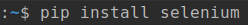
                

            <li>XlsxWriter Module</li>
                

                    Para a criação e manipulação de arquivos Xlsx é necessário a instalação do módulo XlsxWriter.  
                    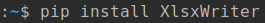
                

            <li>Google Chrome Web Browser</li>
                

                    O projeto utiliza o Google Chrome (v91.0) como seu browser, por isso é necessário que ele estaja previamente instalado e na versão compatível com o WebDriver (localizado na pasta Driver). Para utilizar outras versões do Google Chrome, substitua o driver por um compatível com a versão desejada (<a href="https://chromedriver.chromium.org/downloads"> ChromeDrivers </a>). 
                    <strong>ATENÇÃO: Para utilizar um browser diferente, além de ser necessário que o driver seja substituido por um compatível com o browser desejado, também é necessário que sejam feitas alterações no código do ra_scraper para que o webdriver seja instanciado com a classe compatível com o browser desejado.</strong>
                

        </lu>
    

    
    
        <h4>Execução</h4>
        

        

            Para iniciar o programa, utilize o Python para executar o arquivo main.py 
            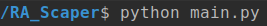 
            Ao se executar o arquivo, sera requisitado que o usuário informe o nome de uma empresa na qual deseja realizar o scraping. 
            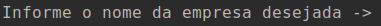 
            Assim que o nome é informado, o programa inicia a pesquisa  
            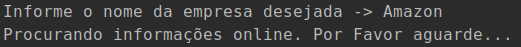 
            O browser é aberto e direcionado para o site "Reclame Aqui", onde é pesquisado o nome da empresa. 
            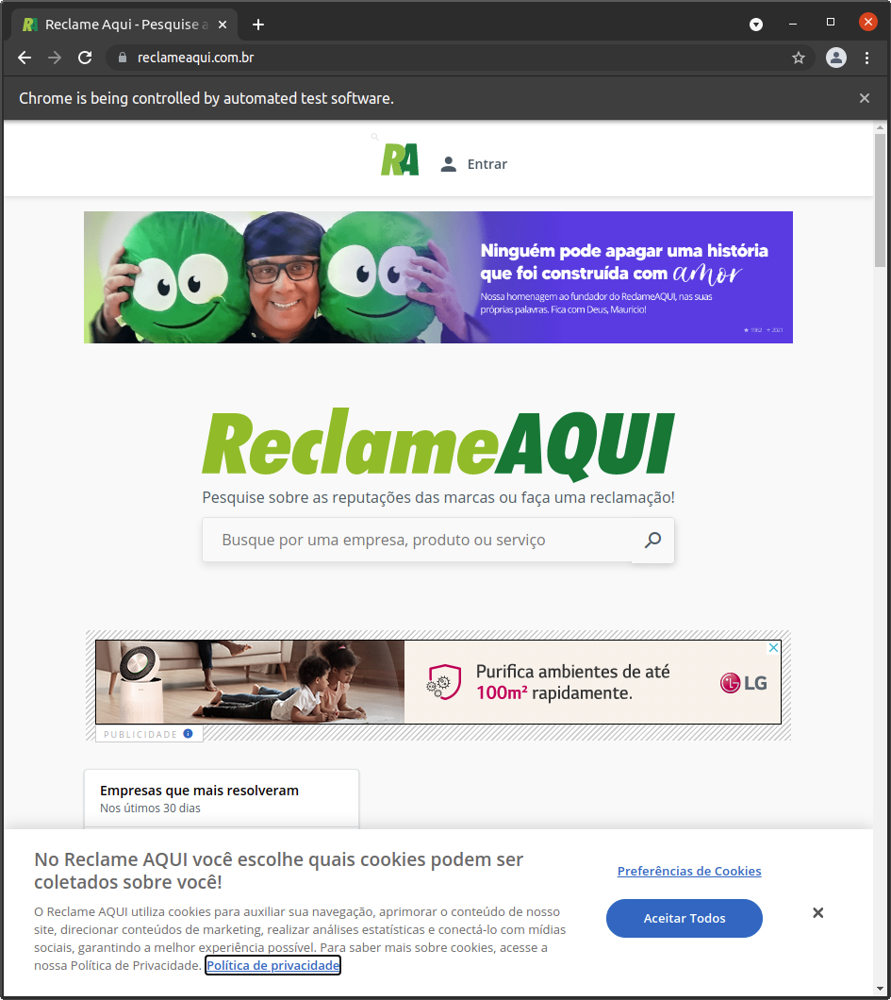
            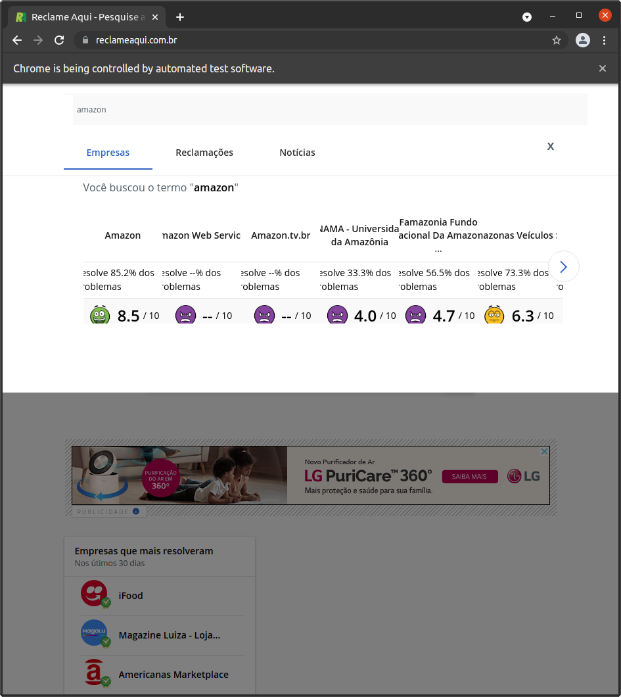
            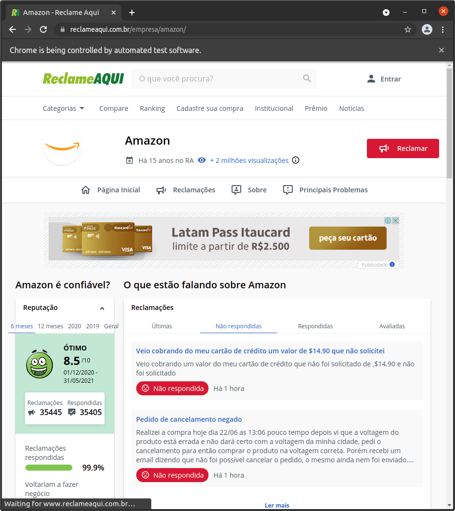 
            Ao finalizar a pesquisa o browser é fechado e os resultados são passado para um arquivo xlsx no diretório "Resultados" com o mesmo nome que a empresa 
            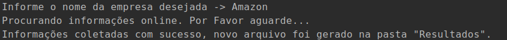 
            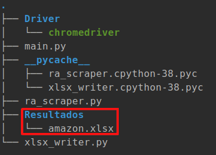 
            As informações no arquivo são escritas em forma de tabelas, divididas em 6 planilhas.  
            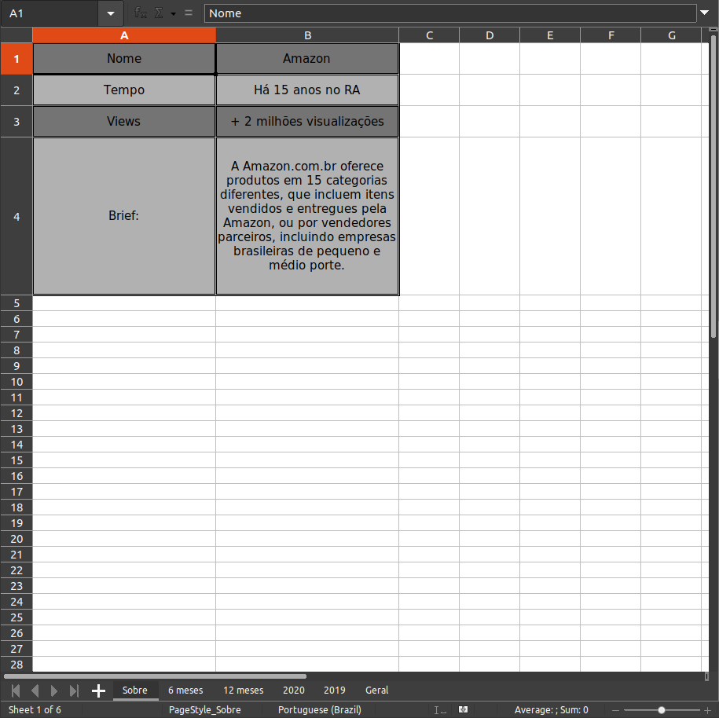
            
            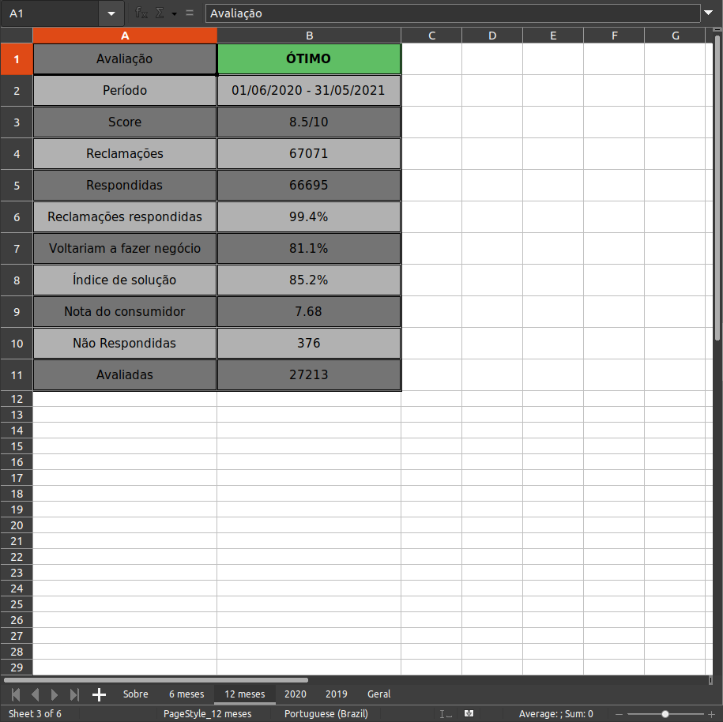
            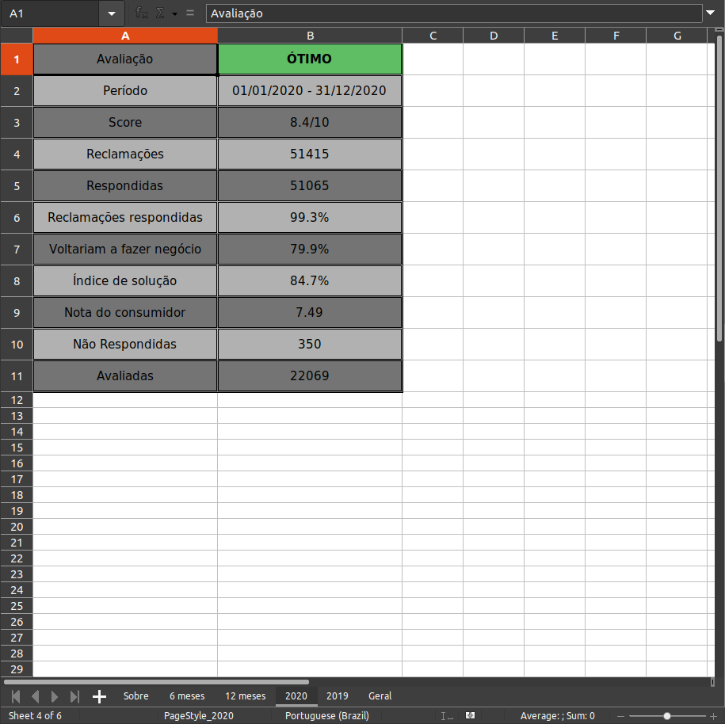
            
            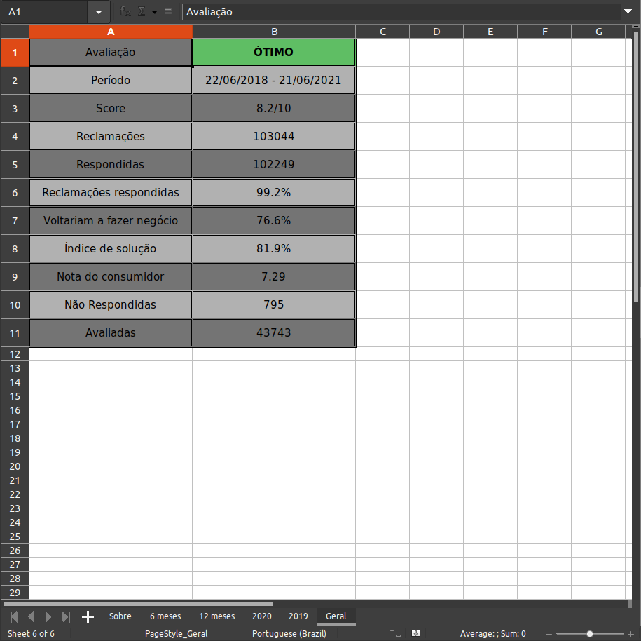
        

    

    <h4>Versão & Tech</h4>
    

         
     
    

    <h4>Autor</h4>
    

    <a href="https://github.com/VitorioValer">
        
         
        <b>__V__</b>
    </a>
     
    
    

